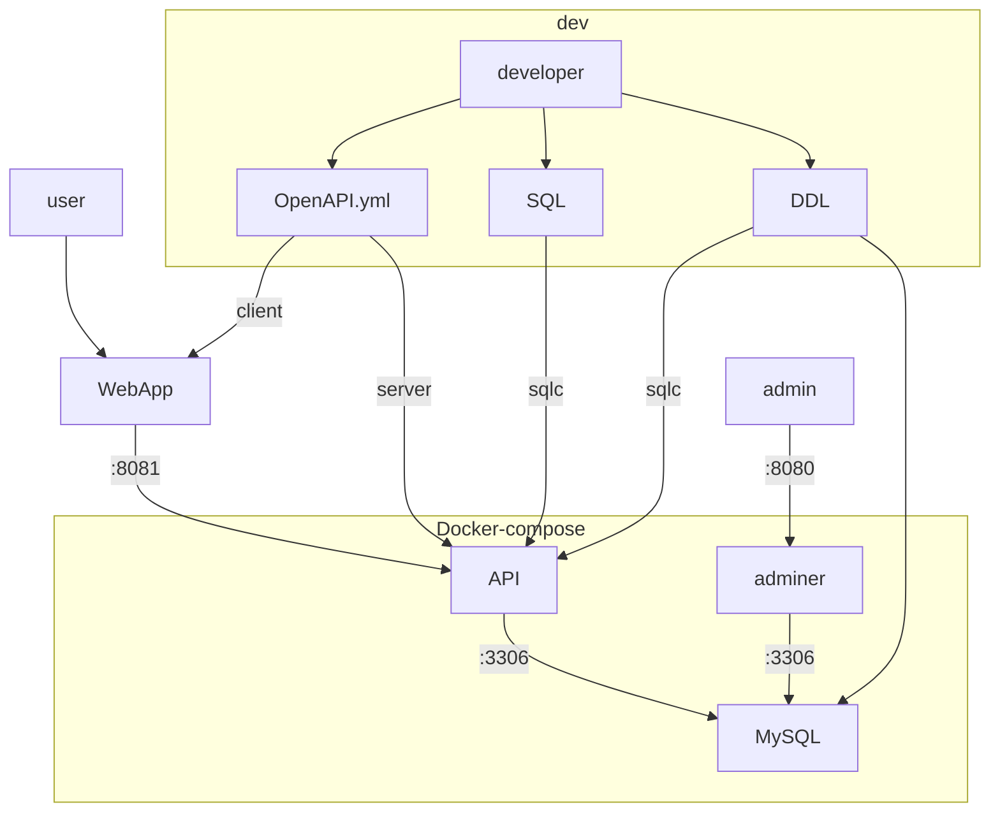

# eventsite_go



## Generate OpenAPI Server

```sh
docker run --rm \
  -v ${PWD}:/local openapitools/openapi-generator-cli generate \
  -i /local/openapi.yml \
  -g go-server \
  --additional-properties=router=chi \
  -o /local/out
```

## Generate sqlc

```sh
sqlc generate
```
