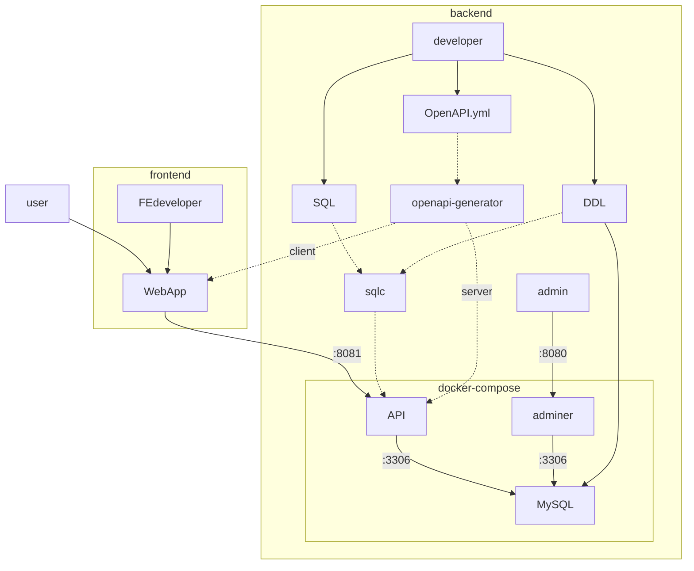

# eventsite_go



## Generate OpenAPI Server

```sh
MSYS_NO_PATHCONV=1 docker run --rm \
  -v ${PWD}:/local openapitools/openapi-generator-cli generate \
  -t /local/template \
  -i /local/openapi.yml \
  -g go-server \
  --additional-properties=router=chi,featureCORS=true \
  -o /local/out
```

```sh
MSYS_NO_PATHCONV=1 docker run --rm \
  -v ${PWD}:/local openapitools/openapi-generator-cli author template \
  -g go-server \
  -o /local/template
```

openapi-generator author template -g java --library webclient

## Generate Frontend

```sh
npx create-next-app@latest --ts frontend
```

## Generate OpenAPI Client

```sh
MSYS_NO_PATHCONV=1 docker run --rm \
  -v "${PWD}:/local" openapitools/openapi-generator-cli generate \
  -i /local/openapi.yml \
  -g typescript-axios \
  -o /local/frontend/openapi
```
  --additional-properties=modelPropertyNaming=camelCase,supportsES6=true,withInterfaces=true,typescriptThreePlus=true \

参考
- https://zenn.dev/erukiti/articles/openapi-generator-typescript-fetch

## Generate sqlc

```sh
sqlc generate
```

### Install sqlc

```sh
go install github.com/kyleconroy/sqlc/cmd/sqlc@v1.10.0
```

https://github.com/kyleconroy/sqlc/issues/1385
